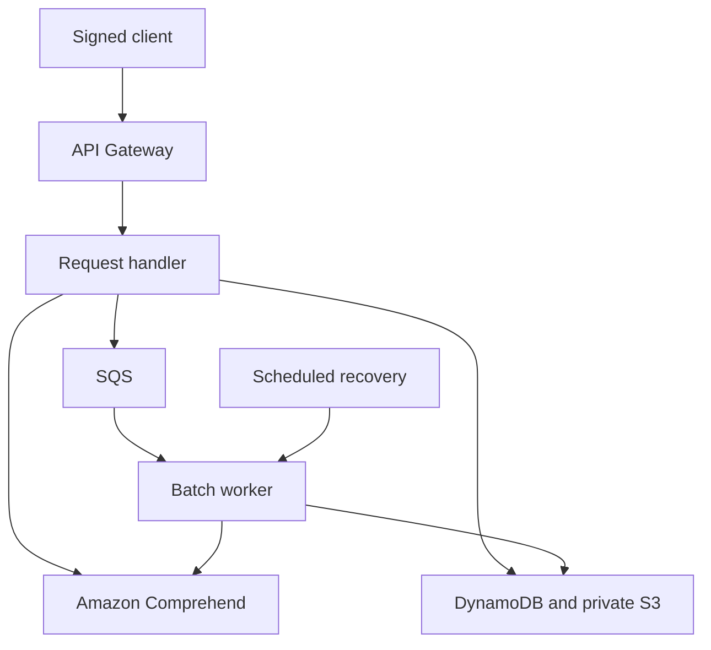

# Sentiment Analysis Service

An authenticated AWS service for analyzing individual text and collections of customer feedback. Upload CSV or JSON, track background jobs, inspect overall and entity-level sentiment, filter results, compare datasets, export files, and configure negative-feedback alerts.

## What it does

- **Single analysis:** `POST /analyze-sentiment` returns positive, negative, neutral, or mixed sentiment and confidence scores.
- **Bulk jobs:** up to 200 records / 1 MiB per upload, processed in resumable batches of 25 with stable IDs and per-record errors.
- **Targeted insights:** optional English entity-level sentiment, source offsets, and excerpts. Returns bounded evidence and explicit truncation flags, not generated explanations.
- **History and reports:** caller-scoped job history, progress, source/product/date/sentiment/confidence filters, daily trends, and two-job comparisons.
- **Exports:** CSV or JSON downloads through S3 URLs that expire after 60 seconds. CSV formula cells are neutralized for spreadsheets.
- **Alerts:** one configurable negative-rate rule per caller, a persistent alert feed, evidence record IDs, and acknowledgement.
- **Controls:** IAM/SigV4 on every application route, atomic daily allowances, API Gateway throttling, bounded Lambda concurrency, retention, CloudWatch alarms, and account-wide budget notifications.



## Try it after deployment

Node.js 24+, AWS credentials for a dedicated consumer IAM role, and `execute-api:Invoke` permission are required. The CLI uses the normal AWS credential chain, including profiles and temporary role credentials.

```bash
npm ci
export AWS_REGION=us-east-1
export API_ENDPOINT=https://API_ID.execute-api.us-east-1.amazonaws.com/dev
npm run client -- analyze 'The product is good, but delivery was late.' --targeted
npm run client -- submit examples/feedback.csv --targeted --key feedback-october-01
npm run client -- status JOB_ID
npm run client -- results JOB_ID --sentiment NEGATIVE
npm run client -- report JOB_ID --product widget
npm run client -- export JOB_ID --format csv --out results.csv
npm run client -- history
npm run client -- compare CURRENT_JOB_ID BASELINE_JOB_ID
npm run client -- rule examples/alert-rule.json
npm run client -- alerts
npm run client -- usage
```

Keep the printed idempotency key when retrying an upload. Repeat submissions with the same key and data reuse the job and do not reserve allowance twice. Changing the payload under the same key returns `409`. A new key deliberately starts new work.

Single requests are synchronous and stateless apart from usage metering. Submit a one-record job when you need retained history and alerts. Alerts are an API feed, not outbound email or arbitrary webhooks; the notification email configured during deployment receives infrastructure and budget alarms.

## Development and deployment

```bash
npm ci
npm run lint
npm test
npm run build
terraform -chdir=terraform init -backend=false
terraform -chdir=terraform validate
terraform -chdir=terraform test
```

For a real deployment, follow the [deployment guide](docs/DEPLOYMENT.md) to bootstrap or select a versioned state bucket, configure an OIDC deployment role, and initialize the environment's remote backend. Never apply against a fresh empty state if this service already exists.

**Version 2 changes:** application endpoints now require IAM authentication; deployments require remote state, OIDC, and a notification email. Existing unauthenticated clients need signed requests. SDK dependencies are pinned and bundled with the Lambda artifact.

## Documentation

- [API contract](docs/API.md) and [OpenAPI](openapi.yaml)
- [Deployment and state migration](docs/DEPLOYMENT.md)
- [GitHub OIDC setup](docs/AWS_OIDC.md)
- [Integration and CLI](docs/INTEGRATION.md)
- [Operations, retry behavior, and retention](docs/OPERATIONS.md)
- [Security and tenant boundaries](docs/SECURITY.md)
- [Version 2 release notes](docs/RELEASE_NOTES.md)

Local tests exercise service behavior with substitutes for AWS. Live AWS deployment, repeated deployment, failure injection, notification delivery, and rollback verification remain tracked in [issue #12](https://github.com/rclevenger-hm/sentiment_analysis_lambda/issues/12).

MIT licensed.
